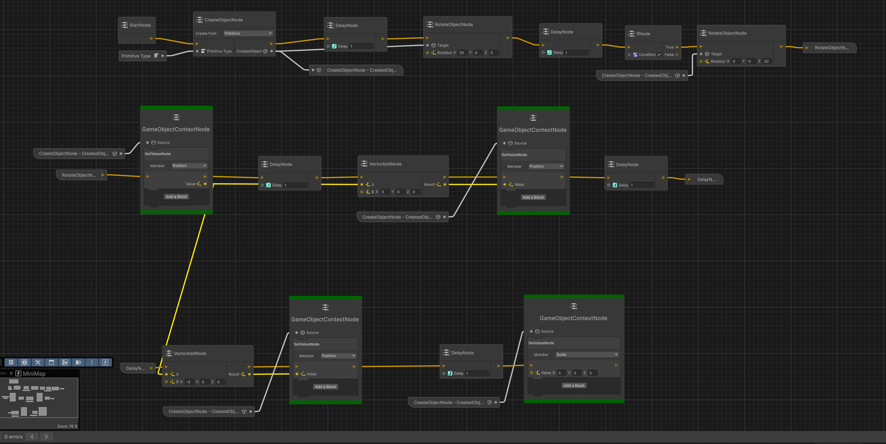
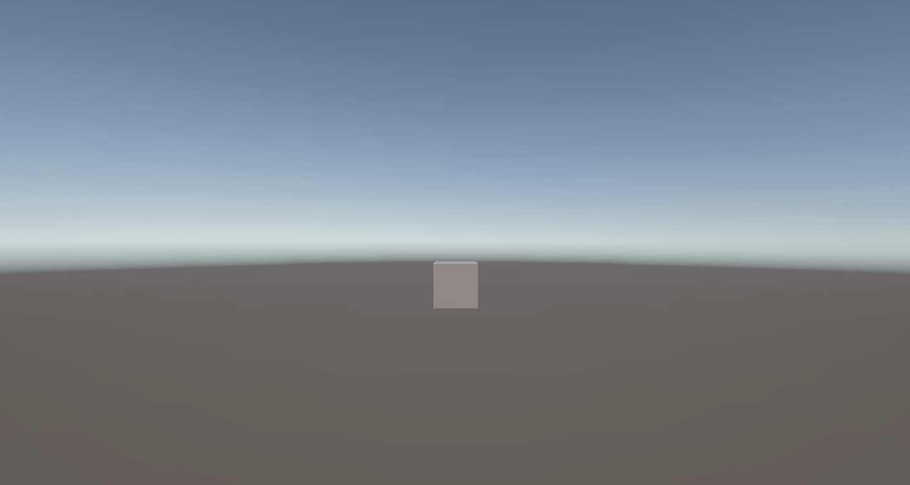

# Simple Script Graph based on Graph Toolkit

## Introduction

This tool is a **very simple implementation of a Graph based scripting tool**. The minimal goal was to allow creation and manipultation of primitives or prefabs in position, rotation, or scale.

The implementation showcases how to use ``Graph Toolkit 0.4.0-exp2`` experimental to implement a visual graph tool to allow such operations.

Simple Sample Graph. 
Simple Sample Graph runtime result.

## Design

The implementation follows separation of a ``Design-Time`` and a ``Runtime`` graph data model.

The ``Design-Time`` graph data model is utilising ``Graph Toolkit`` package and contains all nodes and its connections as well as constants, variables, portals and subgraphs.

The ``Runtime`` graph data model is a custom implementation and is mainly a precompiled result of Design-Time nodes converted into runtime nodes.
This graph ``conversion`` is performed in a Design-Time compilation step which mainly runs in two stages (convert and link stage). During Runtime a Load stage will prepare the runtime for fast performant execution.

***The Conversion stage*** creates one or more operations per Design-Time node which also can perform additional link steps during the link stage.
The operations execute at runtime and drive synchronus or asynchronus logic: i.e. Set, Get, Create, If, While, For, Delay, etc...

***The Link stage*** will performe additional conversion steps after every node in the graph was converted. Additional information can be build and stored such as: Node relation, Member Value transfer, Execution flow, Event Bindings, etc...

***The Runtime Load stage*** is an additional ``Runtime`` stage and will precompute none serializeable operations such as fast ``expression trees``. Such expression trees are used to dynamically resolve and precompute, how transfer of data input and data output is handled between nodes.

## Features

- Create Object (primitive, prefab)
- Delay
- Rotate Game Object
- Branching
- Get/Set Game Object position, rotation, scale

## Node Code Example

Manually create a design-time and runtime node to add rotation to an game object.

```c#
//This node implements design time data model and conversion logic
[Serializable]
class RotateObjectNode : AbstractNode, IRuntimeNodeConverter
{
    protected override void OnDefinePorts(IPortDefinitionContext context)
    {
        //add default execution pins
        AddInputOutputExecutionPorts(context);
        //add two input pins
        context.AddInputPort<GameObject>(nameof(RotateObjectRuntimeNode.Target)).Build();
        context.AddInputPort<Vector3>(nameof(RotateObjectRuntimeNode.Rotation)).Build();
    }

    void IRuntimeNodeConverter.Convert(ICompilationStageContext context, IExecutionBuilder executionBuilder)
    {
        //try to resolve constant pin inputs
        var targetInputPort = GetInputPortByName(nameof(RotateObjectRuntimeNode.Target));
        bool isTargetInputSet = targetInputPort.TryGetCompileTimeInputPortValue<GameObject>(out var target);

        var rotationInputPort = GetInputPortByName(nameof(RotateObjectRuntimeNode.Rotation));
        bool isRotationInputSet = rotationInputPort.TryGetCompileTimeInputPortValue<Vector3>(out var rotation);
        
        //maybe add runtime Get for dynamic pin inputs
        List<IPort> portsToBind = new ();
        if (!isTargetInputSet)
        {
            portsToBind.Add(targetInputPort);
        }

        if (!isRotationInputSet)
        {
            portsToBind.Add(rotationInputPort);
        }

        //create the runtime implementation
        var node = new RotateObjectRuntimeNode
                   {
                       Target = target,
                       Rotation = rotation,
                   };

        executionBuilder
            //push operation that may Get the runtime values from inputs. this can be null and will result in noop if not needed
           .PushExecution(executionBuilder.OperationFactory.CreateRuntimeGetMemberValuesOperation(node, portsToBind.ToArray()))
            //push the runtime implementation execution
           .PushExecution(node)
            //push call to run next node if any
           .PushExecution(executionBuilder.OperationFactory.CreateCallExecutionOperation(GetOutputPortByName(EXECUTION_PORT_DEFAULT_NAME)))
            //set instance data to the runtime node. in this sample execution and instance data is provided by the same implementation but API wise you can separate this.
           .WithInstance(node);
    }
} 
```

Show how to build a corresponding runtime implementation.
```c#
//class implements both instance data and execution for illustration
public class RotateObjectRuntimeNode : AbstractRuntimeNode, IRuntimeNodeExecutor<RotateObjectRuntimeNode>
{
    //input parameters are filled by runtime operations like 'CreateRuntimeGetMemberValuesOperation' as show above
    public Vector3 Rotation;
    public GameObject Target;

    public ValueTask ExecuteAsync(RotateObjectRuntimeNode nodeInstance, IRuntimeContext context)
    {
        //apply the rotation
        nodeInstance.Target.transform.Rotate(nodeInstance.Rotation);
        //return immediate completion
        return default;
    }
}
```


## Prerequisites

- Unity 6000.3.2f1

<h2>Improvements:</h2>

- Source Generator to generate nodes for desired API's
- Refactoring  (Assembly definition files, Nullables, Project cleanup etc..)
- Readme Design, Design Choices, Problems, Improvements
- Runtime Debugging